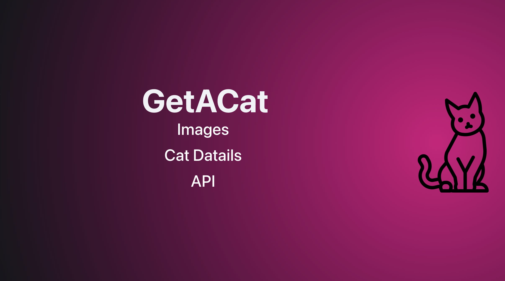
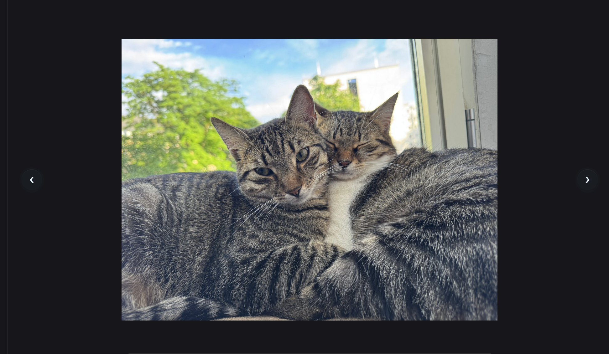
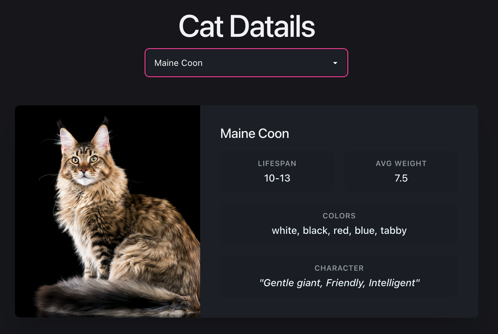
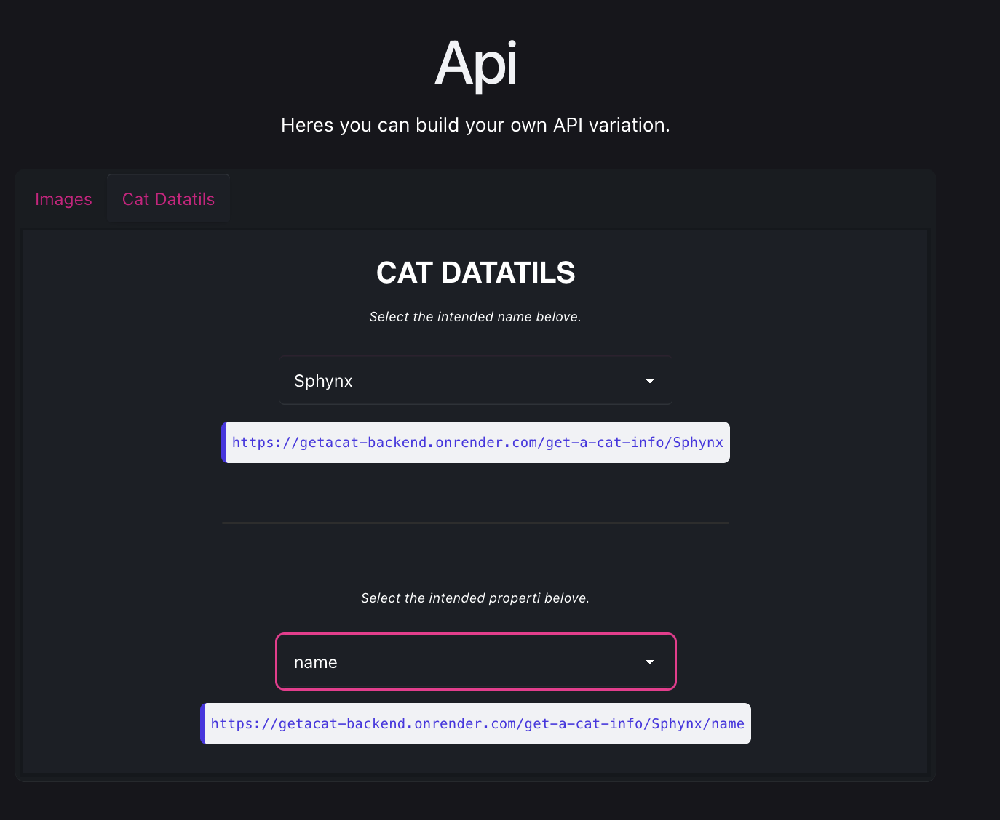
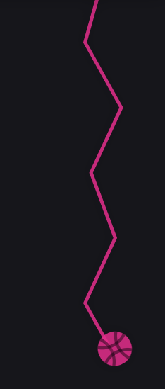

# GetACat Frontend

<p align="center">
    
</p>

# ❓ What is this

This application is modern styled cat focused application. <br>

You can find breed specific properties like: 
* name
* lifespan
* average weight
* colors 
* characteristics
* and an image

Click here 👉 [to navigate to user features](#forusers) <br>
Click here 👉 [to navigate to developer features](#fordevelopers)

# 💻 About this project

This is the frontend code of [GetACat](https://getacat-frontend.netlify.app/). I built this web page as a portfolio project because I wanted to test my frontend skills, mainly focusing on [React](https://react.dev/). This page provides information about cats, such as their lifespan and images. This information comes from the backend, which you can find here 👉 [GetACat_Backend](https://github.com/6gDav/GetACat_Backend).


## <a name="forusers"></a>⚡️ Core Features

This application contains several functions, like: 
* 🌇 **Images** – These images come from [*Imgur*](https://imgur.com/) but are fetched by the [*backend*](https://github.com/6gDav/GetACat_Backend) 
* 💿 **CatDetails** – You can request data about a specific cat breed.
* 🩱 **CostumeAPI** – Availability to make your own API version.

> This project is mainly UI heavy. So I rather deal with UI than functionality.

## 📦 How to access

Access in this 👉 [link](https://getacat-frontend.netlify.app/) <br>

## 🤔 How to use

You are greeted by this navigation bar.

<p align="center">
    
</p>

Just click on the intended option like: 
* Images
* Cat Datails 
* API
<br>
...and it will take you to that section.


Heres the images. 

<hr>

<p align="center">
    
</p>

Click on the arrows to see another cat image.

<hr>

This one is about the mentioned cat details.

<p align="center">
    
</p>

Just select the desired cat breed right below the title.

<hr>

This section is for the self-made API variations.

<p align="center">
    
</p>

You can select: 
* Images: This option provides a single URL that returns all the images you can see above. <br>
*Here's an example:*
```
https://getacat-backend.onrender.com/get-a-cat-info/Sphynx
```
* Cat Datails: Here you can customize your own API request with your desired parameters: 
    * Breed: le.g., *Ragdoll*
    * Property: e.g., *lifespan* <br>
    *Here's an example:*
    ```
    https://getacat-backend.onrender.com/get-a-cat-info/Ragdoll/lifespan
    ```
> Although it's not explicitly mentioned on the page, clicking on the URL will automatically copy it to your clipboard.

<hr>

This one is the yarn ball. 

<p align="center">
    
</p>

> Although it's not explicitly mentioned on the page, clicking on the skein will automatically scroll the page back to the top.

<hr>

## <a name="fordevelopers"></a> 🛠️ Developer Guidance

**Just a heads up:** *like 99% of developers out there, I used AI and premade code during development.*

## 🤬 Design problems

I am aware of all of this.

* ↕️ **Cursor**: At certain page widths, the custom yarn ball cursor overlaps the left arrow of the image carousel.
* 🧪 **Testing**: Automated tests are currently missing. 😀😕

## 📚 Tech Stack


* **[Bun](https://bun.com/)** (the package manager, and JS/TS runtime):
    * **[React](https://react.dev/)** (for the UI)
    * **[framer-motion]()**: A powerful animation library for React
    * **[Vite](https://vite.dev/)** (for fast building)
    * **[TypeScript](https://www.typescriptlang.org/)** (Used programming language)

* **[Netlify](https://www.netlify.com/)** as a hosting service for the web page. 

## 🌳 File tree

```
├── READMEonlyAssest
│   ├── APIDescription.png
│   ├── CatCarosel.png
│   ├── CatDatails.png
│   ├── NavBar.png
│   └── Skein.png
├── public
│   ├── _redirects
│   ├── favicon.svg
│   └── icons.svg
├── src
│   ├── Components
│   │   ├── APIDescription
│   │   │   ├── APIDescription.css
│   │   │   └── APIDescription.tsx
│   │   ├── CatDatails
│   │   │   ├── CatDatails.css
│   │   │   └── CatDatails.tsx
│   │   ├── Footer
│   │   │   ├── Footer.css
│   │   │   └── Footer.tsx
│   │   ├── Header
│   │   │   ├── Header.css
│   │   │   └── Header.tsx
│   │   ├── ImageCarosel
│   │   │   ├── Carosel.css
│   │   │   └── Carosel.tsx
│   │   ├── ScrollIndicator
│   │   │   ├── ScrollIndicator.css
│   │   │   └── ScrollIndicator.tsx
│   │   └── CatSelect.tsx
│   ├── assets
│   │   └── cat.png
│   ├── styles
│   │   ├── App.css
│   │   ├── Responsive.css
│   │   └── index.css
│   ├── App.tsx
│   └── main.tsx
├── .gitignore
├── README.md
├── bun.lock
├── eslint.config.js
├── index.html
├── package-lock.json
├── package.json
├── tsconfig.app.json
├── tsconfig.json
├── tsconfig.node.json
└── vite.config.ts
```

## 👨‍💻 Actual Development

To start development just clone this repository. 
```bash
git clone https://github.com/6gDav/GetACat_Frontend.git
```
Or download the ZIP.

<hr>

Start dev server with this command.
```bash
bun run dev
```

Build the project.
```bash
bun run build
```

<hr>

> May be needed to download all necessary dependencies.

# 🪪 License

This project is licensed under the MIT License - see the [LICENSE](LICENSE) file for details.

